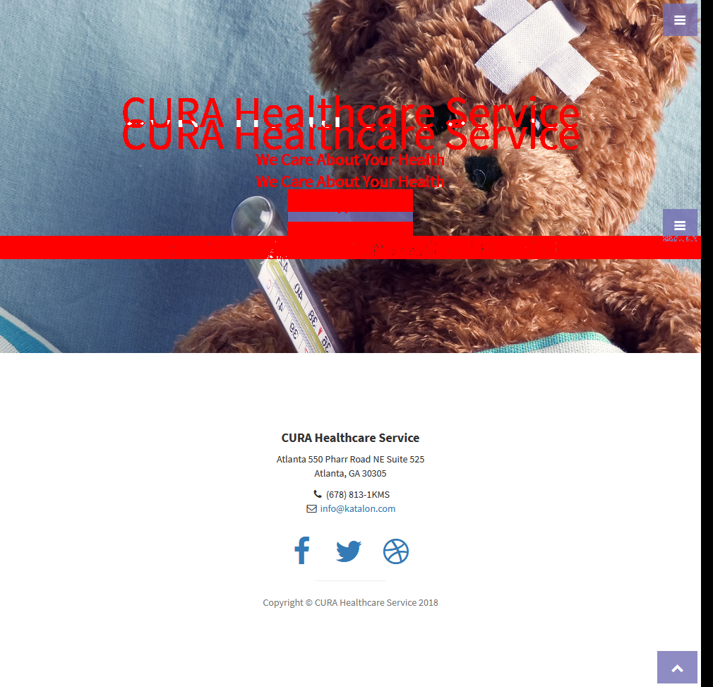
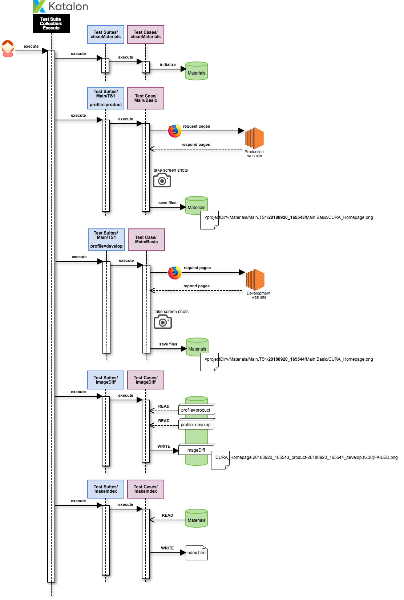
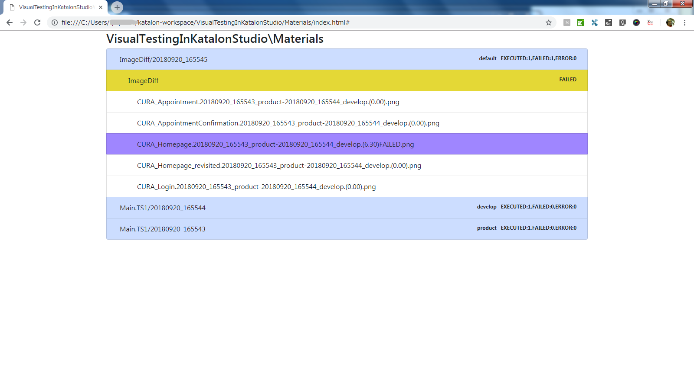

Visual Testing in Katalon Studio
======

# What is this repository?

This is a [Katalon Studio](https://www.katalon.com/) project for demonstration purpose. You can clone this
out to your PC and run it with your Katalon Studio.

This project was developed using Katalon Studio 5.7.0.

This project demonstrates how to perform a
primitive *Visual Testing* in Katalon Studio.

# Problem to solve

What do I mean by the word *Visutal Testing*? Any toolset that provides a solution to my requirements as follows, I would regard it a *Visual Testing* solution.

- Often I have to look at the pages of a Web site. Maybe I am a developer, a designer, a tester or just a fan of the site.
- I want to look at as many pages of the site as possible. Wide coverage matters.
- I want to compare the view of 2 environments; e.g. Production and Development.
- I want to take full-page screen shots of all pages as evidence
- After taking screenshots, I want to check them to find out if there are any differences in view between the two.

If the target Web site has 100 pages, it would take me more than 60 minutes to run through. It's too tiring, too boring. I don't like doing the job everyday! Therefore I would add the final term:

- I want to automate it.

I just want to be notified if 2 environments have any visual differences now. I would not require the tool to be equipped with full fledged debugging functionalities. Preferably it should be free of charge.

## More specificcally ...

In terms of coding test scripts, I found 2 problems.

1. I want to make 2 sets of screen shot files on the local disk of my PC and reuse them. In order to do that, I need to design a specification how the file paths format should be. I would make a Script which writes a file and another script which reads the file; both scripts need to be aware of the path format and respect it. I would call a set of files compliant to the path format spec as `MaterialRepository`. I need a set of Java/Groovy library (jar) which implements `MaterialRepository`.
1. [org.openqa.selenium.TakesScreenshot#getScreenshotAs(output)](https://seleniumhq.github.io/selenium/docs/api/java/org/openqa/selenium/TakesScreenshot.html) enables taking screen shots. But the image taken by this is often not full-page size. The  API doc says <blockquote>this makes a best effort depending on the browser to return the following in order of preference: - The entire content of the HTML element - The visible portion of the HTML element</blockquote>

# Solution

As for the file path problem,
I have developed another project titled:
- [UsingMaterialsInKatalonStudio](https://github.com/kazurayam/UsingMaterialsInKatalonStudio)

This project demonstrates how to take multiple sets of web page screen shots and store them into a well-structured file system tree. This demo project uses another GitHub repository:
- [`Materials`](https://github.com/kazurayam/Materials)

This project provides a jar file which implements `MaterialRepository` = well-defined file tree and provides access methods.

As for the full-page screenshot problem, I found that the library [`aShot`](https://github.com/yandex-qatools/ashot) solves like a charm. I wrote a report how I utilized aShot in Katalon Studio:
- [Entire page screenshot by aShot in Katalon Studio](https://github.com/kazurayam/EntirePageScreenshotByAShotInKatalonStudio)

I was impressed that aShot provides [ImageDiff](https://github.com/yandex-qatools/ashot/blob/master/src/main/java/ru/yandex/qatools/ashot/comparison/ImageDiff.java). This utility class enables me to check very easily how much differences there are amongst 2 images. I wanted to use `ImageDiff` in Katalon Studio. So I have developed another GibHub repository:
- [`ksbackyard`](https://github.com/kazurayam/ksbackyard)

In there I have developed Katalon Custume Keyword [com.kazurayam.ksbackyard.ScreenshotDriver](https://github.com/kazurayam/ksbackyard/blob/master/Keywords/com/kazurayam/ksbackyard/ScreenshotDriver.groovy). ScreenshotDriver is just a small wrapper for aShot. This makes it a bit easier to use aShot functionality in Katalon Test Cases.

I have integrated those external resources to build a toolset of 'Visual Testing' in Katalon Studio.

# How to run the demo

1. git clone this project
1. start Katalon Studio, open this project
1. in `Tests Explorer` pane, click `Test Suites`
1. choose and open a Test Suite Collection `Execute`
1. `Execute` assumes you have Firefox browser installed. In not, please install Firefox
1. execute the Test Suite Collection. it will take a few minutes to finish.
1. find the resulting file `<projectDir>/Materials/index.html`, open it with your favorite web browser.  

Unfortunately you can not view the  `<projectDir>/Materials` directory and its contents inside Katalon Studio GUI. I would recommend you to bookmark  `<projectDir>/Materials/index.html` in your favorite browser for quick access.


# Description of the demo

## Input

The Test Suite Collection `Executes` calls Test Suite `Main/TS1` twice; each time targeting the following URLs:
1. http://demoaut.katalon.com/  --- called *Production environment*
2. http://demoaut-mimic.kazurayam.com/ --- called *Development environment*

## Processing

The Test Suite `Main/TS1` visits the target URL and traverse pages while taking screen shots. Directory named  `./Materials/Main.TS1/yyyyMMdd_hhmmss/Main.Basic` will be created where 5 PNG files are stored.

`Executes` calls Test Suite `ImageDiff`. The Test Suite `ImageDiff` scans 2 directories previously created by `Main/TS1` and compares pairs of PNG files with same file name: e.g. `CURA_Homepage.png`.

The test suite `ImageDiff` generates an PNG file in directory named `./Materials/ImageDiff/yyyyMMdd_hhmmss/ImageDiff`. If any visual difference found, the generated PNG file will show the difference in red color like this:


The following picture shows how our Visual Testing in Katalon Studio goes.




## ImageDiff file naming rule

The file name of ImageDiff will be in the format as follows

1. An ImageDiff file has a name for example: `CURA_Homepage.20180920_165543_product-20180920_165544_develop.(6.30)FAILED.png`
1. prefix part `CURA_Homepage` is equal to the file name prefix of the source image file `CURA_Homepage.png`
2. middle part `yyyyMMdd_hhmmss_PPPPPPP` is equal to the timestamp when test suite `Main/TS` was executed, and `PPPPPPP` is the Katalon Execution Profile applied to the test suite execution.
3. `(6.30)` is called *diff%* = number of read pixcels(differences) / (width * hight of page) * 100
4. `FAILED` is marked by the test suite `ImageDiff` in case that the 2 source images are *too different*.
5. What does "too different" means? The Test Case `ImageDiff` has the following code:
```
CustomKeywords.'com.kazurayam.ksbackyard.ScreenshotDriver.makeDiffs'(
    'product', 'develop', 'Main/TS1', 3.68)
```
The 4th argument is called *criteria%*. If the difference is larger than the criteria% specified, then the generated ImageDiff file will be marked `FAILED`. This mark enables CSS in ./Materials/index.html to show the line highlighted.

## Output

For example, we have the following 2 images as source to compare.

| Production | Development |
|:-----------|:------------|
| File path: `<projectDir>/Materials/Main.TS1/20180920_165543/Main.Basic/CURA_Homepage.png`   | File path: ./Materials/Main.TS1/20180920_165544/Main.Basic/CURA_Homepage.png   |

The test suite collection generates `./Materials/index.html`. This HTML shows a list of source images plus the images as comparison result.

File path: `<projectDir>/Materials/index.html`


If you click the line with purple background color, you will see a ImageDiff with a lot of red-portion. The red portion shows the differences between the two source images.

File path: `<projectDir>/Materials/ImageDiff/yyyyMMdd_hhmmss/ImageDiff/CURA_Homepage.yyyyMMdd_hhmmss_product-yyyyMMdd_hhmmss_develop.(6.30)FAILED.png`


# External dependencies

This Katalon project depends on the following external resources.

## jar

1. ['Materials-x.x.x.jar'](https://github.com/kazurayam/Materials/releases)
2. ['ashot-1.5.4.jar'](https://mvnrepository.com/artifact/ru.yandex.qatools.ashot/ashot/1.5.4)

These are already bundled in the `<projectDir>/Drivers/` directory.

You can download them from their sites and import into the project again. Refer to Katalon
Documentation ["External Libraries"](https://docs.katalon.com/display/KD/External+Libraries).

### Custom Keywords

1. ['ksbackyard'](https://github.com/kazurayam/ksbackyard)

This project imports and uses the CustomKeyword `com.kazurayam.ksbackyard.ScreenshotDriver` developed by the 'ksbackyard' project. You can re-import/update the CustomKeyword. You first download the source of the 'ksbackyard' project from the [Release page](https://github.com/kazurayam/ksbackyard/releases). And copy to Keyword Source from the zip content into the project. See the Katalon documentation ['Import/Export Keywords'](https://docs.katalon.com/pages/viewpage.action?pageId=13698840) for importing operation..
