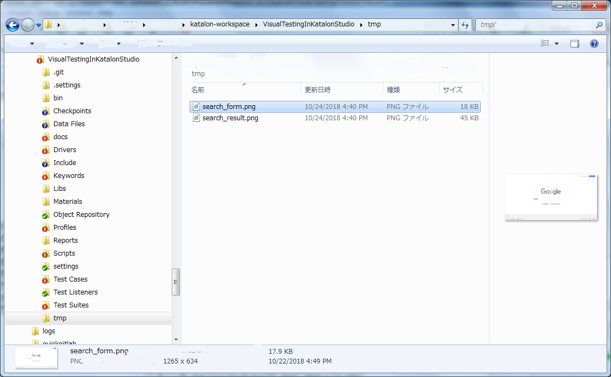
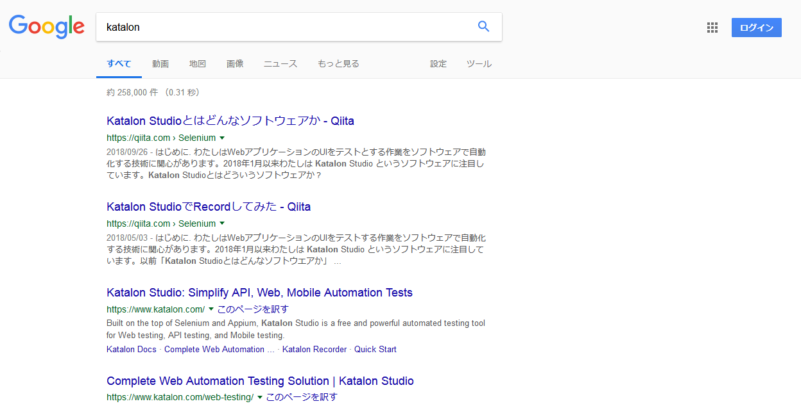

Step by step instruction - how to create a visual testing project from scratch
===========

- Author: kazurayam
- Date: Oct 2018

## Required Katalon Studio version

Katalon Studio 5.7.1 and LOWER is required.

Unfortunately Katalon Studio 5.8.0 and NEWER has a restriction: https://forum.katalon.com/discussion/10315/5-8-0-globalvariable-of-type-null-is-not-allowed-no-longer-store-instances-of-user-defined-class

Due to this restriction, Visual Testing has become difficult in Katalon Studio 5.8.0 and higher.

## Overview

In this note, I will describe how you create a new Katalon Studio project and set it up to carry out *Visual Testing* as I did.

We will create a Katalon Studio project where we will do the following:

1. take screenshots of 2 environments of your AUT (*Application Under Test*) = a pair of different URLs. As a test bed, we will use the Google Search ( https://www.google.com/ and https://www.google.co.jp/ ). We will make a single query with `q=katalon`
2. compare images to find any visual differences
3. make a HTML view of generated image files.

Here is a sample output:


The 2 URLs were same for 99.99%, but had 0.01% of difference. In the above image, you can find a very small section (just a few characters) painted red. This section was the time taken for table search in milliseconds. *Without comparison by the tool, nobody would notice this difference.* :-)

I will use a term '*the demo project*' for short for the  [VisualTestingInKatalonStudio](https://github.com/kazurayam/VisualTestingInKatalonStudio) project.


## Preparation

### prep1: create a new Katalon Studio project

Do it as usual.

### prep2: resolve external dependencies

You need to include 2 external jar files into the new project.

1. `aShot` : WebDriver Screenshot utility. Its jar is public at the [MavenCentral repository](https://mvnrepository.com/artifact/ru.yandex.qatools.ashot/ashot/1.5.4). Also you can reuse the `ashot-1.5.4.jar` contained in the demo project's [`Drivers`](../Drivers) directory.

2. `Materials` : Utility that manages the `<project dir>/Materials` directory where you can store any files created by test cases in a well structured path format. Another project  [UsingMaterialsInKatalonStudio](https://github.com/kazurayam/UsingMaterialsInKatalonStudio) describes how to use the `Materials` library in detail. The Materials-0.22.0.jar file is public at the [releases](https://github.com/kazurayam/Materials/releases) page. Also you can reuse the jar file contained in the demo project's [`Drivers`](../Drivers) directory.

Please refer to the Katalon Documentation [*How to import external libarary into your automation project*](https://docs.katalon.com/katalon-studio/tutorials/import_java_library.html) for Katalon GUI operation.

### prep3: create GlobalVariables for the Materials library to run

The Materials library requires 2 GlobalVariables defined in the Execution Profile.

1. `GlobalVariable.MATERIAL_REPOSITORY` : its type should be Null
2. `GlobalVariable.CURRENT_TESTCASE_ID` : its type should be String

You need to define them in the Execution Profiles in your project. Following screen shot shows 2 variables defined in the *default* Profile.


### prep4: create a Test Listener

You need to create a Test Listener named `Test Listeners/TL` in your project. All `TL` does is to set appropriate values to `GlobalVariable.MATERIAL_REPOSITORY` and `GlobalVariable.CURRENT_TESTCASE_ID`.

You can copy the code of the [`Test Listners/TL`](../Test%20Listeners/TL.groovy) into you test listener `TL`. You need not to modify it at all.

Or if you want you make your own test listener, you can do so of course. Please merge the codes of [`Test Listners/TL`](../Test%20Listeners/TL.groovy) into yours carefully.


### prep5: create Custom Keywords

Following 3 Custom Keywords are required to carry out "Visual Testing". Please make the keyword files and copy the source from the demo project. You do no need to change the source at all.

1. [Keywords/com/kazurayam/ksbackyard/Assert](Keywords/com/kazurayam/ksbackyard/Assert.groovy)
2. [Keywords/com/kazurayam/ksbackyard/ImageCollectionDiffer](Keywords/com/kazurayam/ImageCollectionDiffer.groovy)
3. [Keywords/com/kazurayam/ksbackyard/ScreenshotDriver](Keywords/com/kazurayam/ScreenshotDriver.groovy)

The `ScreenshotDriver` enables you to take page screenshot using [AShot API](https://github.com/yandex-qatools/ashot). The `ImageCollectionDiffer` enables to to compare 2 sets of PNG files and generates a set of ImagDiff files. The `Assert` is a utility to manage exceptional cases with logging and flow control.

## Creating your Visual Testing test

Now you are ready to create a new Visual Testing project in Katalon Studio for yourself. I will tell you how to step by step.

### Test scenario

We need a test scenario anyway. Let me set our scenario as follows:

1. We will visit the following 2 URL.
   - https://www.google.com/ncr
   - https://www.google.co.jp/ncr
2. We will perform search with `q="katalon"`
3. We will take entire-page screen shots of the search form page and the search result page.
4. We will compare the images. If not identical, we want to know how much of visual differences are there, and reason why.

*[NCR(no country redirect)](https://whatis.techtarget.com/definition/NCR-no-country-redirect) is a Google search parameter that tells the search engine to show results for the country specified in the URL rather than redirecting to the country from which the search is being conducted. You can override the redirection by adding `/ncr` (No Country Redirect) to the Google URL for the country in question : https://www.google.com/ncr*

### step1: A simple test case as starting point

At first you want a simple test case where you use ordinary Katalon-built-in features only. No tricks at all. The test case would do the following.

Here is the source: [`Test Cases/StepByStep/TC_step1 - start up`](../Scripts/StepByStep/TC_step1 - start upScript1540079039662.groovy)

```
import static com.kms.katalon.core.testobject.ObjectRepository.findTestObject

import java.nio.file.Files
import java.nio.file.Path
import java.nio.file.Paths

import com.kms.katalon.core.configuration.RunConfiguration
import com.kms.katalon.core.webui.keyword.WebUiBuiltInKeywords as WebUI

// resolve output dir
Path projectDir = Paths.get(RunConfiguration.getProjectDir())
Path outdir = projectDir.resolve('tmp')
Files.createDirectories(outdir)

// open browser
WebUI.openBrowser('')
WebUI.setViewPortSize(1279, 720)

// navigate to the Google form page
WebUI.navigateToUrl('https://www.google.com/')

WebUI.verifyElementPresent(findTestObject('StepByStep/Page_Google_search/input_q'), 10)
WebUI.setText(findTestObject('StepByStep/Page_Google_search/input_q'), 'katalon')

// take screen shot and save it into search_form.png file
Path fileF = outdir.resolve("search_form.png")
WebUI.takeScreenshot(fileF.toString())

// submit query, page is transfered to the Google result page
WebUI.submit(findTestObject('StepByStep/Page_Google_search/input_q'))
WebUI.verifyElementPresent(findTestObject('StepByStep/Page_Google_result/div_g_1'), 10)

// take scree shot and save it into search_result.png file
Path fileR = outdir.resolve("search_result.png")
WebUI.takeScreenshot(fileR.toString())

// close browser
WebUI.closeBrowser()
```

You can run this test case just as usual. Once ran it, you will find output files created in the *&lt;projectDir&gt;*`/tmp` folder.


### step2: Resolve output file path using Materials library

We want the output files are located at path managed by the Materials library. We are to change the test case slightly.

Here is the source: [`Test Cases/StepByStep/TC_step2 - Materials applied`](../Scripts/StepByStep/TC_step2 - Materials applied/Script1540078133927.groovy)
```
import com.kazurayam.materials.MaterialRepository
import internal.GlobalVariable as GlobalVariable

...

MaterialRepository mr = (MaterialRepository)GlobalVariable.MATERIAL_REPOSITORY

...

URL urlF = new URL(WebUI.getUrl())
Path fileFnamedByURL = mr.resolveScreenshotPath(GlobalVariable.CURRENT_TESTCASE_ID, urlF)
WebUI.takeScreenshot(fileFnamedByURL.toString())

...
WebUI.submit(findTestObject('StepByStep/Page_Google_search/input_q'))
WebUI.verifyElementPresent(findTestObject('StepByStep/Page_Google_result/div_g_1'), 10)

...

URL urlR = new URL(WebUI.getUrl())
Path fileRnamedByURL = mr.resolveScreenshotPath(GlobalVariable.CURRENT_TESTCASE_ID, urlR)
WebUI.takeScreenshot(fileRnamedByURL.toString())
```

`GlobalVariable.MATERIAL_REPOSITORY` and `GlobalVariable.CURRENT_TESTCASE_ID` are set with values by the Test Listener [`Test Listners/TL`](../Test Listeners/TL.groovy).


The step2 is calling  `com.kazurayam.materials.MaterialRepository#resolveScreenshotPath(String testCaseId, URL url)` method. This method generates URL-based file name for screenshots. For example: `https%3A%2F%2Fwww.google.com%2F.png`. This file name is generated from the URL https://www.google.com/

You can run the test case step2 just as usual. The output will be written in the folder *&lt;projectDir&gt;*`/Materials/_/_/StepByStep.TC_step2 - Materials applied`


Are you curious about the strange path *&lt;projectDir&gt;*`/Materials/_/_` ? This will be explained later.


### step3: Take entire page screen shots

The step2 script used the `WebUI.takeScreenshot()` built-in method to take screen shot of web pages. Unfortunately this method, with Firefox browser, can not take entire page screenshot. For example, the screen shot of the search result page will show top 3 or 4 links.
  

We want entire page screen shots. Therefore we will use a custom kyword `com.kazurayam.ksbackyard.ScreenshotDriver` backed by [AShot](https://github.com/yandex-qatools/ashot).

Here is the scritp source: [`Test Cases/StepByStep/TC_step3`](../Scripts/StepByStep/TC_step3 - Entire page screenshot/Script1540091299462.groovy)
```
...
CustomKeywords.'com.kazurayam.ksbackyard.ScreenshotDriver.saveEntirePageImage'(
	fileFnamedByURL.toFile())

...

CustomKeywords.'com.kazurayam.ksbackyard.ScreenshotDriver.saveEntirePageImage'(
	fileRnamedByURL.toFile())
```

The `saveEntirePageImage()` method generates a entire-page screen shot like this:


### step4: Parameterize URL in question by Execution Profiles

We are going to visit 2 URL using a single set of test scripts. We should parameterize the URL out of the test scripts. The best way is to create 2 Execution Profiles for each URLs.

I made 2 profiles named `google.com` and `google.co.jp` in the demo  project. Principally the name of Profile can be any. Each profiles contains a set of GlobalVariables: `URL`. as parameters which are environment-dependent.

Profle > `google.com`


Profile > `google.co.jp`


The Materials libary does require 2 GlobalVariables:
`MATERIAL_REPOSITORY` and `CURRENT_TESTCASE_ID` to be defined in the Profile `google.com` and `google.co.jp` as well.

### step5: Convention file names

The test case [step4](../Scripts/StepByStep/TC_step4%20-%20parameterized%20URL/Script1540091257737.groovy) uses [`MaterialRepository#resolveScreenshotPath(String testCaseId, URL url)`](https://kazurayam.github.io/Materials/com/kazurayam/materials/MaterialRepository.html). The generated file names as follows:

| Profile      | URL                        | File name |
| ------------ | -------------------------- | ------------------------------------- |
| google.co.jp | https://wwww.google.co.jp/ | https%3A%2F%2Fwww.google.co.jp%2F.png |
| google.com   | https://www.google.com/    | https%3A%2F%2Fwww.google.com%2F.png   |

Now we want to compare the two files. In order to make the processing simple, we need to put the same name to the pair of files 

| Profile      | URL                        | File name |
| ------------ | -------------------------- | --------------- |
| google.co.jp | https://wwww.google.co.jp/ | search_form.png |
| google.com   | https://www.google.com/    | search_form.png |

The test case [step5](../Scripts/StepByStep/TC_step5/Script1540190327767.groovy) would use `MaterialRepository#resolveMaterialPath(String testCaseId, String fileName)` as follows:
```
//DONT Path fileFnamedByURL = mr.resolveScreenshotPath(GlobalVariable.CURRENT_TESTCASE_ID, urlF)
Path fileF = mr.resolveMaterialPath(GlobalVariable.CURRENT_TESTCASE_ID, "search_form.png")
```

### step6: Test Suite Collection to activate a Test Suite multiple times using different profiles

### step7: Make Materials/index.html

### step8: compare images of 2 URLs, generate ImageDiff

### step9: clearing ./Materials dir first


so.
