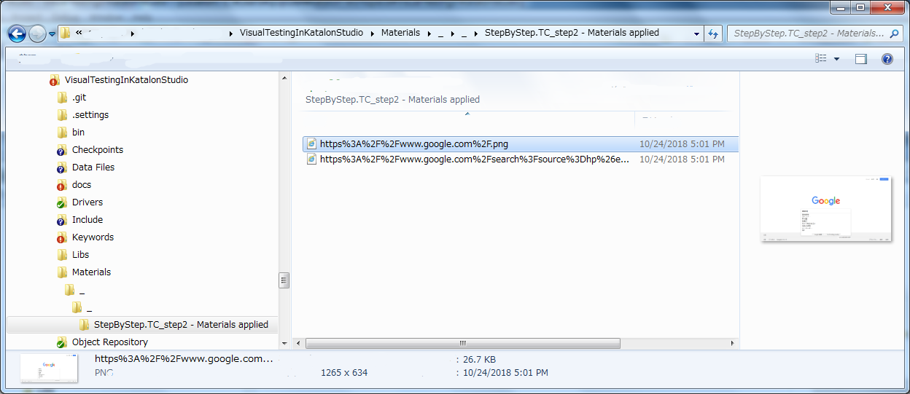
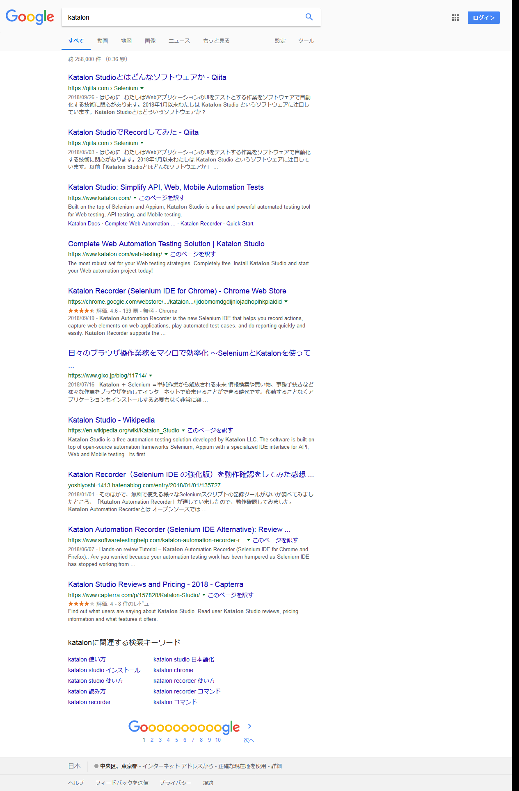
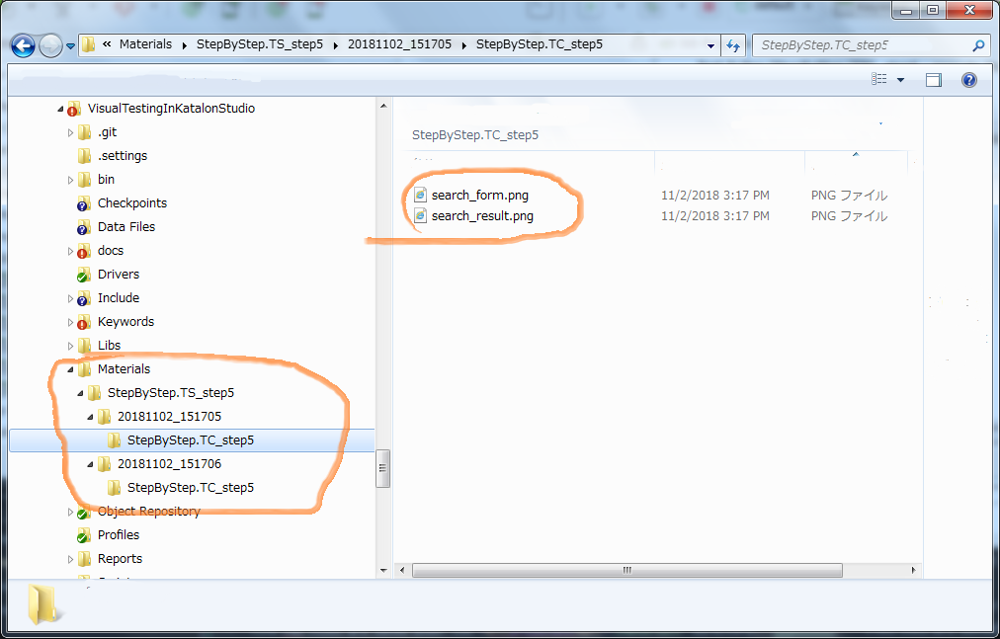
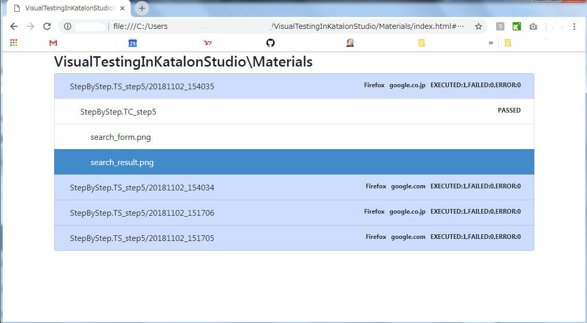
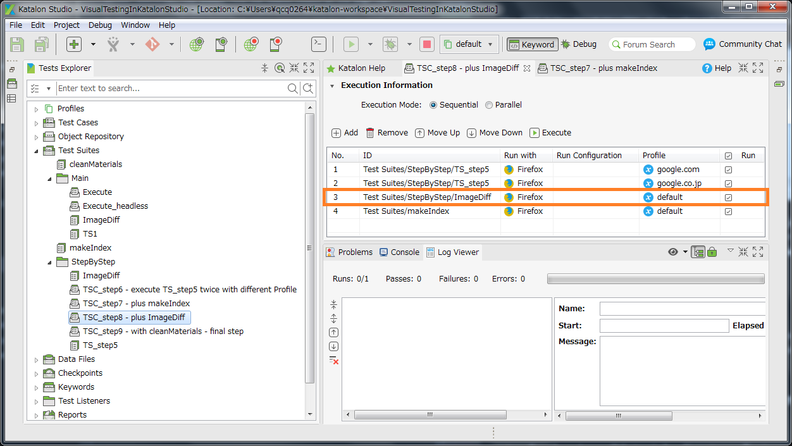

Step by step instruction - how to create a visual testing project from scratch
===========

- Author: kazurayam
- Date: 22 November 2018

## Required Katalon Studio version

Katalon Studio 5.7.1 and lower, or 5.8.4 and upper is required.

Unfortunately Katalon Studio 5.8.0 .. 5.8.3 has a restriction: https://forum.katalon.com/discussion/10315/5-8-0-globalvariable-of-type-null-is-not-allowed-no-longer-store-instances-of-user-defined-class

## Overview

In this note, I will describe how you create a new Katalon Studio project and set it up to carry out a *Visual Testing* as I did.

I will create a Katalon Studio project where I do the following:

1. take screenshots of 2 environments of your AUT (*Application Under Test*) = a pair of different URLs. As a test bed, we will use the Google Search ( https://www.google.com/ and https://www.google.co.jp/ ). We will make a single query with `q=katalon`
2. compare screenshots to find visual differences
3. make a HTML view of generated image files.

Here is a example output:


The 2 URLs were almost the same for 99.99% except 0.01% of difference. In the above image, you can find a very small area (just a few characters) is painted red. This section was the milliseconds taken for table search. *Without comparison by the tool, this difference would never be noticed.* :-)

## Preparation

I will use a term '*the demo project*' for short for the  [VisualTestingInKatalonStudio](https://github.com/kazurayam/VisualTestingInKatalonStudio) project.


### prep1: create a new Katalon Studio project

Do it as usual.

### prep2: resolve external dependencies

You need to include 2 external jar files into the new project.

1. `aShot` : WebDriver Screenshot utility. Its jar is public at the [MavenCentral repository](https://mvnrepository.com/artifact/ru.yandex.qatools.ashot/ashot/1.5.4). Also you can reuse the `ashot-1.5.4.jar` contained in the demo project's [`Drivers`](../Drivers) directory.

2. `Materials` : Utility that manages the `<project dir>/Materials` directory where you can store any files created by test cases in a well structured path format. The Materials-0.24.0.jar file is public at the [releases](https://github.com/kazurayam/Materials/releases) page. Also you can reuse the jar file contained in the demo project's [`Drivers`](../Drivers) directory.

>Another project  [UsingMaterialsInKatalonStudio](https://github.com/kazurayam/UsingMaterialsInKatalonStudio) describes how to use the `Materials` library in detail.

Please refer to the Katalon Documentation [*How to import external libarary into your automation project*](https://docs.katalon.com/katalon-studio/tutorials/import_java_library.html) for Katalon GUI operation.

### prep3: create GlobalVariables for the Materials library

The Materials library requires 2 GlobalVariables defined in the Execution Profile.

1. `GlobalVariable.MATERIAL_REPOSITORY` : its type should be Null
2. `GlobalVariable.CURRENT_TESTCASE_ID` : its type should be String

You need to define them in the Execution Profiles in your project. Following screen shot shows 2 variables defined in the *default* Profile.


### prep4: create a Test Listener

You need to create a Test Listener named `Test Listeners/TL` in your project. All `TL` does is to set appropriate values to `GlobalVariable.MATERIAL_REPOSITORY` and `GlobalVariable.CURRENT_TESTCASE_ID`.

You can copy the code of the [`Test Listners/TL`](../Test%20Listeners/TL.groovy) into you test listener `TL`. You need not to modify it at all.

Or if you want you make your own test listener, you can do so of course. Please merge the codes of [`Test Listners/TL`](../Test%20Listeners/TL.groovy) into your one  carefully.


### prep5: create Custom Keywords

Following 3 Custom Keywords are required to carry out "Visual Testing". Please make the keyword files and copy the source from the demo project. You do no need to change the source at all.

1. [Keywords/com/kazurayam/ksbackyard/Assert](../Keywords/com/kazurayam/ksbackyard/Assert.groovy)
2. [Keywords/com/kazurayam/ksbackyard/ImageCollectionDiffer](../Keywords/com/kazurayam/ksbackyard/ImageCollectionDiffer.groovy)
3. [Keywords/com/kazurayam/ksbackyard/ScreenshotDriver](../Keywords/com/kazurayam/ksbackyard/ScreenshotDriver.groovy)

The `ScreenshotDriver` keyword enables you to take page screenshot using [AShot API](https://github.com/yandex-qatools/ashot). The `ImageCollectionDiffer` keyword processes a List of pairs of screenshots and generates a set of difference image files. The `Assert` keyword is a utility to manage exceptional cases with logging and flow control.

## Creating your Visual Testing test

Now you are ready to create a new Visual Testing project in Katalon Studio for yourself. I will tell you how to step by step.

### Test scenario

We need a test scenario anyway. Let me set our scenario as follows:

1. We will visit the following 2 URL.
   - https://www.google.com/ncr
   - https://www.google.co.jp/ncr
2. We will perform Google search with `q="katalon"`
3. We will take entire-page screen shots of the search form page and the search result page.
4. We will compare the images of a URL. If not identical, we want to know how much of visual differences are there.

>*[NCR(no country redirect)](https://whatis.techtarget.com/definition/NCR-no-country-redirect) is a Google search parameter that tells the search engine to show results for the country specified in the URL rather than redirecting to the country from which the search is being conducted. You can override the redirection by adding `/ncr` (No Country Redirect) to the Google URL for the country in question : https://www.google.com/ncr*

### step1: A simple test case as starting point

At first you want a simple test case where you use ordinary Katalon-built-in features only. Here is the source:
[`Test Cases/StepByStep/TC_step1 - start up`](../Scripts/StepByStep/TC_step1%20-%20start%20up/Script1540079039662.groovy)

```
import static com.kms.katalon.core.testobject.ObjectRepository.findTestObject

import java.nio.file.Files
import java.nio.file.Path
import java.nio.file.Paths

import com.kms.katalon.core.configuration.RunConfiguration
import com.kms.katalon.core.webui.keyword.WebUiBuiltInKeywords as WebUI

// resolve output dir
Path projectDir = Paths.get(RunConfiguration.getProjectDir())
Path outdir = projectDir.resolve('tmp')
Files.createDirectories(outdir)

// open browser
WebUI.openBrowser('')
WebUI.setViewPortSize(1279, 720)

// navigate to the Google form page
WebUI.navigateToUrl('https://www.google.com/')

WebUI.verifyElementPresent(findTestObject('StepByStep/Page_Google_search/input_q'), 10)
WebUI.setText(findTestObject('StepByStep/Page_Google_search/input_q'), 'katalon')

// take screen shot and save it into search_form.png file
Path fileF = outdir.resolve("search_form.png")
WebUI.takeScreenshot(fileF.toString())

// submit query, page is transfered to the Google result page
WebUI.submit(findTestObject('StepByStep/Page_Google_search/input_q'))
WebUI.verifyElementPresent(findTestObject('StepByStep/Page_Google_result/div_g_1'), 10)

// take scree shot and save it into search_result.png file
Path fileR = outdir.resolve("search_result.png")
WebUI.takeScreenshot(fileR.toString())

// close browser
WebUI.closeBrowser()
```
No tricks at all.

You can run this test case just as usual. Once ran it, you will find output files created in the *&lt;projectDir&gt;*`/tmp` folder.


### step2: Resolve output file path using Materials library

We want the output files are located at path managed by the Materials library. We are to change the test case slightly.

Here is the source: [`Test Cases/StepByStep/TC_step2 - Materials applied`](../Scripts/StepByStep/TC_step2%20-%20Materials%20applied/Script1540078133927.groovy)
```
import com.kazurayam.materials.MaterialRepository
import internal.GlobalVariable as GlobalVariable

...

MaterialRepository mr = (MaterialRepository)GlobalVariable.MATERIAL_REPOSITORY

...

URL urlF = new URL(WebUI.getUrl())
Path fileFnamedByURL = mr.resolveScreenshotPath(GlobalVariable.CURRENT_TESTCASE_ID, urlF)
WebUI.takeScreenshot(fileFnamedByURL.toString())

...
WebUI.submit(findTestObject('StepByStep/Page_Google_search/input_q'))
WebUI.verifyElementPresent(findTestObject('StepByStep/Page_Google_result/div_g_1'), 10)

...

URL urlR = new URL(WebUI.getUrl())
Path fileRnamedByURL = mr.resolveScreenshotPath(GlobalVariable.CURRENT_TESTCASE_ID, urlR)
WebUI.takeScreenshot(fileRnamedByURL.toString())
```

`GlobalVariable.MATERIAL_REPOSITORY` and `GlobalVariable.CURRENT_TESTCASE_ID` are set with values by the Test Listener [`Test Listners/TL`](../Test%20Listeners/TL.groovy).


The step2 is calling  `com.kazurayam.materials.MaterialRepository#resolveScreenshotPath(String testCaseId, URL url)` method. This method generates URL-based file name for screenshots. For example: `https%3A%2F%2Fwww.google.com%2F.png`. This file name is generated by converting the URL string `https://www.google.com/`. `:` is converted to `%3A`. `/` is converted into `%2F`.

You can run the test case step2 just as usual. The output will be written in the folder *&lt;projectDir&gt;*`/Materials/_/_/StepByStep.TC_step2 - Materials applied`



Are you curious about the strange path *&lt;projectDir&gt;*`/Materials/_/_` ? This will be explained later.


### step3: Take entire page screen shots

The step2 script uses built-in `WebUI.takeScreenshot()` method to take screen shot of web pages. Unfortunately this method can not take entire page screenshot. For example, the screen shot of the search result page will show just top 3 or 4 links.
  

But I want entire page screen shots. Therefore I will use a custom keyword `com.kazurayam.ksbackyard.ScreenshotDriver` backed by [AShot](https://github.com/yandex-qatools/ashot).

Here is the scritp source: [`Test Cases/StepByStep/TC_step3`](../Scripts/StepByStep/TC_step3%20-%20Entire%20page%20screenshot/Script1540091299462.groovy)

```
...
CustomKeywords.'com.kazurayam.ksbackyard.ScreenshotDriver.saveEntirePageImage'(
	fileFnamedByURL.toFile())

...

CustomKeywords.'com.kazurayam.ksbackyard.ScreenshotDriver.saveEntirePageImage'(
	fileRnamedByURL.toFile())
```

The `saveEntirePageImage()` method generates a entire-page screen shot like this:



### step4: Parameterize URL in question by Execution Profiles

I am going to visit 2 URL using a single set of test scripts. Therefore I need to parameterize the URL out of the test scripts. The best way is to create 2 Execution Profiles for each URLs.

I made 2 profiles named `google.com` and `google.co.jp` in the demo  project. Principally the name of Profile can be any. Each profiles contains a set of GlobalVariables: `URL`. as parameters which are environment-dependent.

Profle > `google.com`


Profile > `google.co.jp`


The Materials libary does require 2 GlobalVariables:
`MATERIAL_REPOSITORY` and `CURRENT_TESTCASE_ID` to be defined in the Profile `google.com` and `google.co.jp` as well.

### step5: Identical file names

The test case [step4](../Scripts/StepByStep/TC_step4%20-%20parameterized%20URL/Script1540091257737.groovy) uses [`MaterialRepository#resolveScreenshotPath(String testCaseId, URL url)`](https://kazurayam.github.io/Materials/com/kazurayam/materials/MaterialRepository.html). The generated file names as follows:

| Profile      | URL                        | File name |
| ------------ | -------------------------- | ------------------------------------- |
| google.co.jp | https://wwww.google.co.jp/ | https%3A%2F%2Fwww.google.co.jp%2F.png |
| google.com   | https://www.google.com/    | https%3A%2F%2Fwww.google.com%2F.png   |

Now we want to compare the two files. In order to make the processing simple, we will use  `com.kazurayam.materials.MaterialRepository#createMaterialPairs()`. This method requires 2 files should have the same name.

Therefore the test case [step5](../Scripts/StepByStep/TC_step5/Script1540190327767.groovy) gives simple file names `search_form.png` and `search_result.png` to both files taken from 2 URLs.

| Profile      | URL                        | File names |
| ------------ | -------------------------- | --------------- |
| google.co.jp | https://wwww.google.co.jp/ | search_form.png,  serach_result.png |
| google.com   | https://www.google.com/    | search_form.png, search_result.png |

The test case [step5](../Scripts/StepByStep/TC_step5/Script1540190327767.groovy) would use `MaterialRepository#resolveMaterialPath(String testCaseId, String fileName)` as follows:

```
// Path fileFnamedByURL = mr.resolveScreenshotPath(GlobalVariable.CURRENT_TESTCASE_ID, urlF)
Path fileF = mr.resolveMaterialPath(GlobalVariable.CURRENT_TESTCASE_ID, "search_form.png")
```

### step6: Test Suite Collection to activate a Test Suite multiple times using different profiles

I want to take screenshots of https://www.google.com/  https://www.google.co.jp/. I can do that by executing the test case [step5](../Scripts/StepByStep/TC_step5/Script1540190327767.groovy) while specifying a URL via Execution Profile. Therefore you need to execute the test case step5 twice while specifying 2 Profiles `google.com` and `google.co.jp`.

You can implement this by creating
- a Test Suite `Test Suites/StepByStep/TS_step5`
- a Test Suite Collection `Test Suites/StepByStep/TSC_step6 - execute TS_step5 twice with different Profile`.

The `Test Suites/TSC_step6` looks like this:


Please note that the Test Suite Collection `TSC_step6` executes the Test Suite `TS_step5` twice while applying Profile `google.com` and `google.co.jp` each.

The Test Suite `Test Suites/TS_step5` looks like this:

All it does is to call `Test Cases/StepByStep/TC_step5`. Not tricks there.

When you execute the Test Suite Collection  `Test Suites/TSC_step6`, you will find PNG files are saved under the *&lt;projectDir&gt;*`/Materials` directory.


### step7: Make Materials/index.html

You can generate *&lt;projectDir&gt;*`/Materials/index.html` file by calling `makeIndex()` method of `com.kazurayam.materials.MaterialRepository` object. The index page generated will looks like this:


By clicking one of the row in the index.html You can open a screenshot image in a modal window.


The index pages shows what you can see by Windows Explorer or Mac Finder. No more than that. But the index page is more convenient to view contents of *&lt;projectDir&gt;*`/Materials/index.html` than those generic tools. Why? In the index page,

1. Test Suite results are sorted by reverse order of the timestamp of Test Suites' execution. You always find the newest result at the page top.
2. Meta data of Test Suite execution are shown: which browser was used, which Profile was applied, how many test cases were run and how many test cases failed.
3. In the modal window, various types of files are rendered nicely: JSON is pretty-printed, XML is indented, images are auto-resized to fit the modal window's width, etc.
4. Windows Explorer does *LOCK* the files and directories while you are viewing them in the Explorer windows. Sometimes this LOCK causes Katalon Studio to fail getting access to the files in the Materials directory. Once race condition occurs, you have to restart Windows OS. This is very annoying. Therefore you should avoid using Windows Explorer as much as possible. On the other hand, Web Browsers does not *LOCK* the files in the Materials directory at all. You should use `Materials/index.html` in browser as it does not cause any race condition.

You can create *&lt;projectDir&gt;*`/Materials/index.html` file by running [Test Cases/cleanIndex](../Scripts/cleanMaterials/Script1534134775171.groovy)

The `Test Suites/StepByStep/TSC_step7 - plus makeIndex` shows how to make index.html in practice. It will look like this.


In the Test Suite Collection `TSC_step7` you run the Test Suite `TS_step5` twice applying the Profiles `google.com` and `google.co.jp` for each. After that you run the Test Suite `Test Suites/makeIndex`. The source of `Test Cases/makeIndex` is here:
- [Test Cases/makeIndex](../Scripts/makeIndex/Script1534133594816.groovy)

This test case is just calling `makeIndex()` method of `com.kazurayam.materials.MaterialRepository` object without any parameters. The method scans the  *&lt;projectDir&gt;*`/Materials` directory for all contained files and generates *&lt;projectDir&gt;*`/Materials/index.html` file.

### step8: running ImageDiff to compare screenshots of two URLs

We will go one step forward. We will first take screenshots of 2 URLS and store the images into the `Materials` directory, and then we will compare the images to find visual differences. The `Test Suites/StepByStep/TSC_step8 - plus ImageDiff` executes this processing.


The difference between the step7 and step8 is only one point: Step8 calls `Test Suites/StepByStep/ImageDiff` immediately after calling `Test Suites/StepByStep/TSC_step5` twice.

The Test Suite `Test Suites/StepByStep/ImageDiff` simply calls a Test Case `Test Cases/StepByStep/ImageDiff`. Click the following link to see the source of the test case:
- [ImageDiff](../Scripts/StepByStep/ImageDiff/Script1540083424391.groovy)

The core part of the test case `ImageDiff` is as follows:
```
MaterialRepository mr = (MaterialRepository)GlobalVariable.MATERIAL_REPOSITORY

List<MaterialPair> materialPairs = mr.createMaterialPairs(
		new TSuiteName('Test Suites/StepByStep/TS_step5')
		).stream().filter { mp ->
			mp.getLeft().getFileType() == FileType.PNG
		}.collect(Collectors.toList())

new ImageCollectionDiffer(mr).makeImageCollectionDifferences(
		materialPairs,
		new TCaseName(GlobalVariable.CURRENT_TESTCASE_ID),  // 'Test Cases/StepByStep/ImageDiff'
		0.50)
```

This code snippet is short but in fact a lot of details are hidden in the external Java classes.

`com.kazurayam.materials.MaterialRepository#createMaterialPairs(TSuiteName)` returns a List<MaterialPairs>. See the javadoc comment of the method at the line 340 of [MaterialRepositoryImpl](https://github.com/kazurayam/Materials/blob/develop/src/main/groovy/com/kazurayam/materials/MaterialRepositoryImpl.groovy)


>Scans the Materials directory to look up pairs of Material objects to compare.
>
>This method perform the following search under the &lt;projectDir&gt;/Materials directory in order to identify which Material object to be included.
>
> 1. selects all &lt;projectDir&gt;/Materials/&lt;Test Suite Name&gt;/&lt;yyyyMMdd_hhmmss&gt; directories with the name equals to the Test Suite Name specified as argument tSuiteName
>
> 2. among them, select the directory with the 1st latest timestamp. This one is regarded as "Actual one".
> 3. among them, select the directory with the 2nd latest timestamp. This one is regarded as "Expected one".
> 4. please note that we do not check the profile name which was applied to each Test Suite run. also we do not check the browser type used to each Test Suite run.
> 5. Scan the 2 directories selected and create a List of Material objects. 2 files which have the same path under the &lt;yyyyMMdd_hhmmss&gt; directory will be packaged as a pair to form a MaterialPair object.
> 6. A List&lt;MaterialPair&gt; is created, fulfilled and returned as the result


The `com.kazurayam.ksbackyard.ImageCollectionDiffer` class is a custom keyword , it is located [here](../Keywords/com/kazurayam/ksbackyard/ImageCollectionDiffer.groovy) in the Keywords directory.

```
/**
 * compare 2 Material files in each MaterialPair object,
 * create ImageDiff and store the diff image files under the directory
 * ./Materials/<tSuiteName>/yyyyMMdd_hhmmss/<tCaseName>.
 * The difference ratio is compared with the criteriaPercent given.
 * Will be marked FAILED if any of the pairs has greater difference.
 *
 * @param materialPairs created by
 *     com.kazurayam.materials.MaterialRpository#createMaterialPairs() method
 * @param tCaseName     created by com.kazurayam.materials.TCaseName(String)
 * @param criteriaPercent e.g. 3.00 percent. If the difference of
 *     a MaterialPair is greater than this,
 *     the MaterialPair is evaluated FAILED   
 */
void makeImageCollectionDifferences(
        List<MaterialPair> materialPairs,
        TCaseName tCaseName,
        Double criteriaPercent) {

    ...

}

```

Executing `Test Suites/StepByStep/TSC_step8 - plus ImageDiff` will creates `<projectDir>/Materials/StepByStep.ImageDiff` directory as well as `<projectDir>/Materials/StepByStep.TS_step5`. In the `<projectDir>/Materials/StepByStep.ImageDiff` directory you will find image files which shows the difference of each pairs of screenshots.

```
C:\USERS\QCQ0264\KATALON-WORKSPACE\VISUALTESTINGINKATALONSTUDIO\MATERIALS
│  
│  index.html
│  
├─StepByStep.ImageDiff
│  └─20181122_143352
│      └─StepByStep.ImageDiff
│          └─StepByStep.TC_step5
│                  search_form.20181122_143351_google.com-20181122_143352_google.co.jp.(0.00).png
│                  search_result.20181122_143351_google.com-20181122_143352_google.co.jp.(0.01).png
│                  
└─StepByStep.TS_step5
    ├─20181122_143351
    │  └─StepByStep.TC_step5
    │          search_form.png
    │          search_result.png
    │          
    └─20181122_143352
        └─StepByStep.TC_step5
                search_form.png
                search_result.png
```

An ImageDiff file has following format of file name:
`search_result.20181122_143351_google.com-20181122_143352_google.co.jp.(0.01).png`

| file name element | meaning |
|:------------------|:--------|
| `search_result`   | Material file name without extension (`.png`)  |
| `.`               |   |
| `20181122_143351` | Timestamp of Expected image  |
| `_`               |   |
| `google.com`      | Execution Profile applied to the Test Suite run as Expected one |
| `_`               |   |
| `20181122_143352` | Timestamp of Actual image  |
| `-`               |   |
| `google.co.jp`    | Execution Profile applied to the Test Suite run as Actual one  |
| `.`               |   |
| `(0.01)`          | Difference of Expected & Actual images in percentage  |
| `.`               |   |
| `png`             | image file type: PNG  |

The &lt;projectDir&gt;`Materials/index.html` page now includes the contents of `StepByStep.ImageDiff` directory as follows:


### step9: clearing ./Materials directory first

If you execute the `Test Suites/StepByStep/step8` and other test suites
multiple times, in the Materials repository many sub-directories will be created.


Old records are, in most cases, useless but will NOT be removed automatically. These sub-directories will be retained until you intentionally remove them.

The Test Suite Collection `Test Suites/StepByStep/TSC_step9 - with cleanMaterials - final step` shows how to clear the Materials directory.


The `TSC_step9` calls `Test Suites/cleanMaterials` which calls [`Test Cases/cleanMaterials`](../Scripts/cleanMaterials/Script1534134775171.groovy)

```
MaterialRepository mr = (MaterialRepository)GlobalVariable.MATERIAL_REPOSITORY

Helpers.deleteDirectoryContents(mr.getBaseDir())
```

This code removes all the contents under the `Materials` directory recursively but retains the `Materials` directory itself.

The `Test Suites/StepByStep/TSC_step9 - with cleanMaterials - final step` will generate `Materials/index.html` cleared out as follows:


## Conclusion

I believe that automated visual testing is an effective method to detect unplanned/accidental changes made somehow in your Web app. In this document I have tried to describe in detail how to get started with "Visual Testing in Katalon Studio" --- comparing 2 sites (production & developement) visually by taking screenshots and making diffs. Please try.
